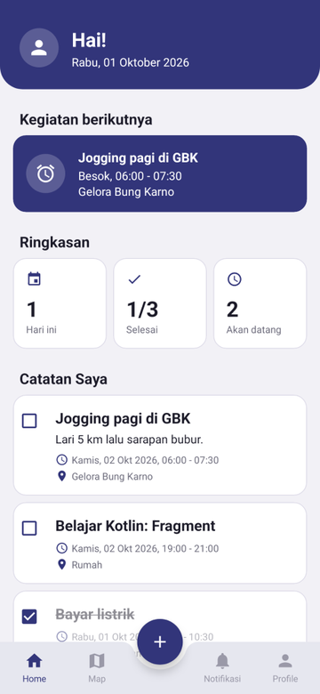
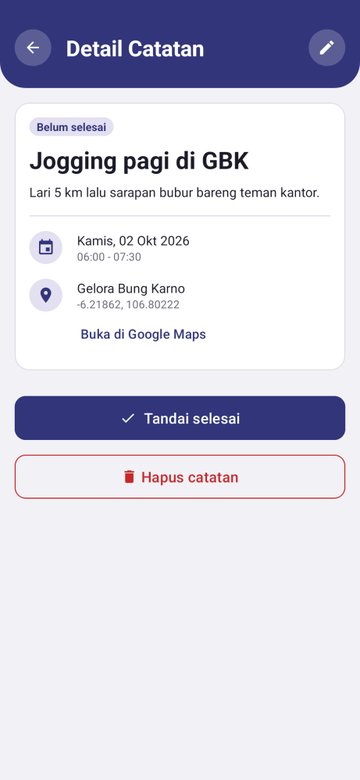
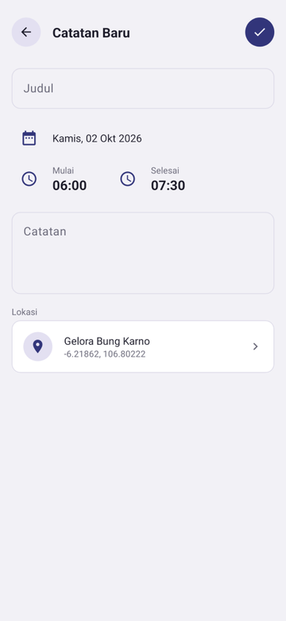
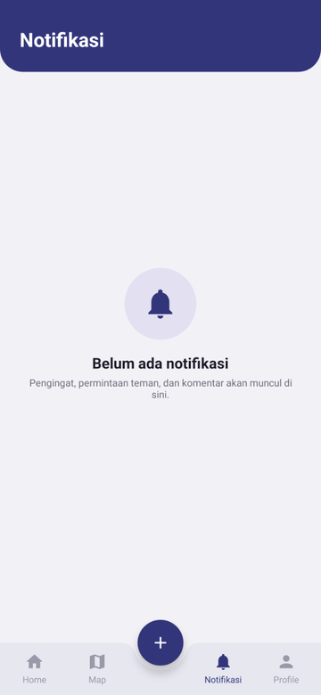
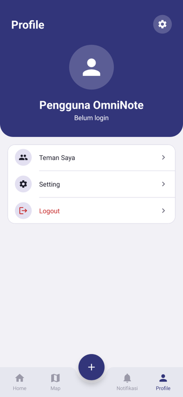
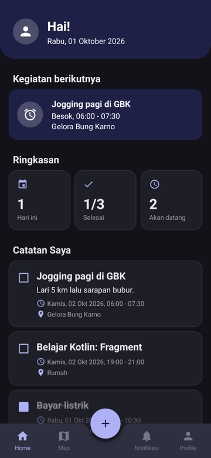
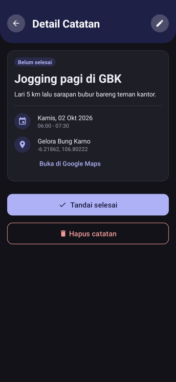
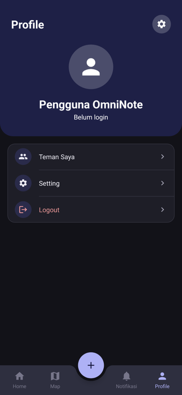

# OmniNote Connect

Aplikasi to-do dengan alarm pengingat dan lokasi kegiatan. Dibangun sebagai proyek belajar Android
(Kotlin, XML), dengan rencana dikembangkan jadi to-do berbasis sosial: catatan bisa dilihat teman,
tampil di peta, dan bisa dikomentari.

**Status: MVP (v0.1.0).** Semua fitur berjalan offline di HP. Akun, teman, dan sinkronisasi belum ada.
Rencana lengkapnya ada di [ROADMAP.md](ROADMAP.md).

## Screenshot

| Home | Detail catatan | Tambah catatan |
| :---: | :---: | :---: |
|  |  |  |

| Welcome | Notifikasi | Profile |
| :---: | :---: | :---: |
|  |  |  |

**Mode gelap**

| Home | Detail catatan | Profile |
| :---: | :---: | :---: |
|  |  |  |

> Screenshot di atas adalah hasil render layout dengan data contoh, bukan tangkapan layar dari HP.

## Fitur

- **Catatan kegiatan**: judul, catatan, tanggal, jam mulai–selesai, dan lokasi.
- **Pilih lokasi di peta**: geser peta sampai pin tepat di lokasi. Nama tempat terisi otomatis dari alamat dan bisa diubah.
- **Alarm pengingat**: notifikasi muncul beberapa menit sebelum kegiatan dimulai. Kalau diklik, notifikasi membuka detail catatan.
  Alarm dijadwalkan ulang otomatis setelah HP restart.
- **Tandai selesai**: lewat checkbox di daftar atau tombol di detail. Catatan yang selesai dicoret dan pindah ke bawah.
- **Detail catatan**: edit, hapus, dan buka lokasi di Google Maps.
- **Home**: kartu kegiatan berikutnya dan ringkasan (hari ini, selesai, akan datang).
- **Setting**: mode gelap, nyala/mati pengingat, waktu pengingat (tepat saat mulai sampai 1 jam sebelum), dan izin alarm tepat waktu.

## Coba langsung (APK)

1. Buka halaman [Releases](https://github.com/narayoga/KTX-omninote/releases) dan unduh file `OmniNoteConnect-*.apk` terbaru.
2. Buka file tersebut di HP Android (minimal Android 5.1), lalu izinkan **Instal aplikasi tidak dikenal** kalau diminta.
3. Saat pertama dibuka, izinkan **notifikasi** (supaya pengingat muncul) dan **lokasi** (supaya lokasi awal terisi).

Hal yang perlu diketahui:

- **Android 12 ke atas**: buka *Profile → Setting → Alarm tepat waktu* dan izinkan. Tanpa izin ini, pengingat tetap muncul tapi bisa terlambat beberapa menit.
- **Peta** butuh API key Google Maps saat build. Kalau APK di-build tanpa key, peta tampil kosong.
- Ini build **debug** untuk testing. Semua data hanya tersimpan di HP.

## Build sendiri

Kebutuhan: Android Studio (atau JDK 17 + Android SDK platform 34).

1. Clone repo ini lalu buka di Android Studio.
2. Buat file `local.properties` di folder utama proyek, lalu isi API key Google Maps:
   ```
   MAPS_API_KEY=isi_api_key_kamu
   ```
   Tanpa key, aplikasi tetap bisa di-build, tapi peta tampil kosong.
3. Jalankan ke HP/emulator, atau build APK lewat terminal:
   ```
   ./gradlew assembleDebug
   ```
   Hasilnya ada di `app/build/outputs/apk/debug/app-debug.apk`.

### Membuat Release baru

APK di halaman Releases dibuat otomatis oleh GitHub Actions ([.github/workflows/release.yml](.github/workflows/release.yml)).
Cukup buat tag yang diawali `v` lalu push:

```
git tag v0.2.0
git push origin v0.2.0
```

Supaya peta berfungsi di APK hasil Actions, simpan API key di
*Settings → Secrets and variables → Actions* dengan nama `MAPS_API_KEY`.

> **Penting, karena repo ini publik:** API key yang ikut di dalam APK bisa diambil siapa saja yang mengunduh APK.
> Batasi key tersebut di Google Cloud Console (*APIs & Services → Credentials*) supaya hanya bisa dipakai oleh aplikasi ini:
> pilih *Android apps*, lalu isi package name `com.example.omninoteconnect` dan SHA-1
> `89:80:A7:34:0D:A3:7E:C1:CF:23:D3:32:C7:A0:F5:08:97:B3:CF:6E`, serta batasi API-nya ke *Maps SDK for Android*.

### Tentang `app/debug.keystore`

Build debug ditandatangani dengan kunci milik proyek (`app/debug.keystore`, password `android`), bukan kunci debug
bawaan Android Studio. Tujuannya supaya APK versi baru bisa dipasang menimpa versi lama tanpa uninstall, dan SHA-1 di
atas tidak berubah. Kunci ini **bukan rahasia** dan hanya untuk build debug. Kalau nanti aplikasi dirilis ke Play Store,
buat kunci release terpisah yang tidak disimpan di repo.

Kalau di HP sudah terpasang versi yang di-build dengan kunci lain (misalnya dari Android Studio sebelum perubahan ini),
uninstall dulu sekali.

## Teknologi

- Kotlin, layout XML, ViewBinding
- Room (database lokal) + Paging, ViewModel + LiveData
- Google Maps SDK + Fused Location
- AlarmManager + notifikasi untuk pengingat
- AndroidX Preference untuk halaman Setting

## Struktur singkat

```
app/src/main/java/com/example/omninoteconnect/
├── alarm/      # jadwal alarm, notifikasi pengingat, jadwal ulang setelah restart
├── data/Note/  # entity, DAO, database (Room), repository
├── ui/         # DashboardActivity (bottom bar) dan layar-layar: Home, Map, Notification, Profile, Note, Setting
└── util/       # helper tanggal/jam, mode gelap, date/time picker
```
